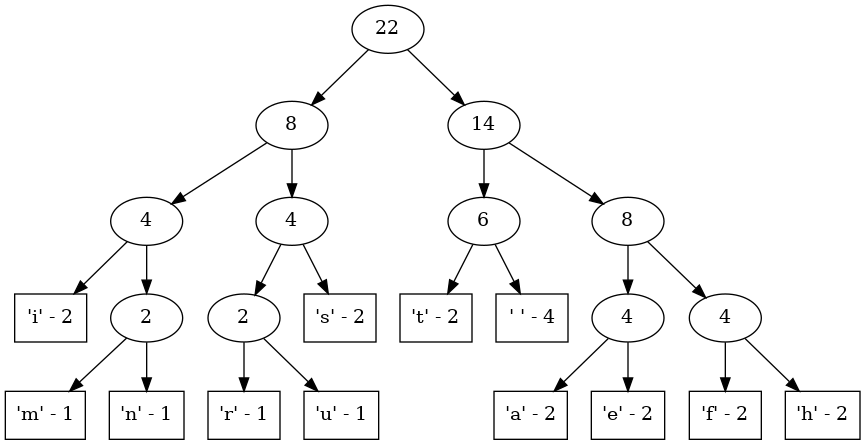

# The Huffman coding

## Usage
```
Huffman coding

  -s SAMPLE   --sample=SAMPLE   The set of symbols to use to create the tree
  -h          --help            Displays this help message
  -t          --tree, --dot     The tree in .dot format
  -a          --canonical       Use the canonical Huffman code for generating the codewords, encoding and decoding
  -c          --codewords       The list of the codewords
  -e MESSAGE  --encode=MESSAGE  Encodes a message
  -d MESSAGE  --decode=MESSAGE  Decodes a message
```

## Printing Huffman trees

This executable allows you to print the representation of the binary tree using the `dot` syntax.

Example : `huffman -s "this is a huffman tree" -t | dot -Tpng -o tree.png`



## Encoding/decoding examples

Encoding : 
```sh
$ huffman -s "coucoutoi" -e "touco"
01111100011
```
Decoding : 
```sh
$ huffman -s "coucoutoi" -d "01111100011"
touco
```
## Getting the canonical codewords

The canonical Huffman code is a particular kind of huffman coding which makes it unique.

```
huffman -s "this is a huffman tree" -ca
  -> 000
i -> 100
s -> 101
t -> 110
a -> 1110
e -> 1111
f -> 1000
h -> 1001
m -> 1010
n -> 1011
r -> 1100
u -> 1101```